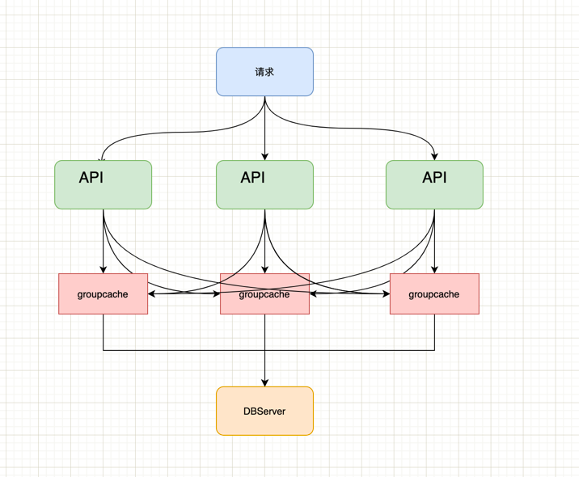
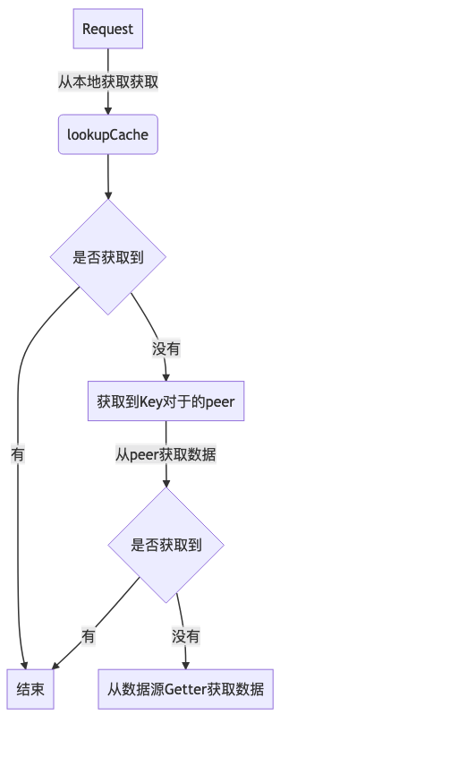

# [groupcache][1]

## 一句话描述

groupcache 是一个分布式缓库

## 简介

### groupcache是什么？

* groupcache 是一个分布式缓库
* 地址：github.com/golang/groupcache
* 是Server又是 Client
* 与其他peer相连
* 热点缓存副本

## Example

```shell
git clone git@github.com:colinrs/groupcache-db-example.git
cd groupcache-db-example
make run
```

* [git@github.com:colinrs/groupcache-db-example.git][2]
* Example的简单架构图



* API服务接收来自用户的请求
 * 每一个API服务都有一个groupcache实例
 * groupcache 最终的数据源是 DBServer

## 代码概览

```sh
├── byteview.go # 字节操作
├── byteview_test.go
├── consistenthash #一致性hash实现
├── groupcache.go # cache操作
├── groupcache_test.go
├── groupcachepb # pb文件
├── http.go # http 服务
├── http_test.go
├── lru # LRU 实现
├── peers.go # 操作peer
├── singleflight 
├── sinks.go
└── testpb

```

### 核心的存储结构

#### Group
```golang
type Group struct {
	name       string
	getter     Getter // 获取数据接口
	peersOnce  sync.Once // 保证初始化一次peer
	peers      PeerPicker // peer获取
	cacheBytes int64 // 对缓存大小的限制接口
	mainCache cache // mainCache 是分布式中本地分配到的cache部分
	hotCache cache // hotcache是由于访问频率高而被复制到此节点的缓存,尽管本节点不是它的拥有者。
	loadGroup flightGroup // 保证key只会获取一次
	_ int32
	Stats Stats
}
```

## 流程分析

### 初始化

```golang

// InitCache ...
func InitCache(port string) {
	// HTTP Server 设置
	opt := &groupcache.HTTPPoolOptions{
		Replicas: 1, // 缓存副本
		BasePath: "/gouache/", // 缓存请求路径
	}
	// peers地址
	cacheGroupHosts := []string{"http://127.0.0.1:8001", "http://127.0.0.1:8002", "http://127.0.0.1:8003"}
	// peer 初始化
	peers := groupcache.NewHTTPPoolOpts("http://127.0.0.1:" + cachePort, opt)
	peerMap := consistenthash.New(opt.Replicas, opt.HashFn)
	peerMap.Add(cacheGroupHosts...)
	cacheGroup := groupcache.NewGroup("SlowDBCache", 64<<20, groupcache.GetterFunc(
		// 源数据获取实现
		))
	peers.Set(cacheGroupHosts...) //设置peers地址
	logger.Info("cachegroup:%s slave starting on:127.0.0.1:%s",cacheGroup.Name(), cachePort)
	// 开启HTTP服务
	logger.Fatal(http.ListenAndServe(fmt.Sprintf("127.0.0.1:%s",cachePort),http.HandlerFunc(peers.ServeHTTP)))
}
```

* groupcache.NewHTTPPoolOpts 初始化和设置HTTP Server
* groupcache.NewGroup 初始化和设置cache
* consistenthash.New 初始化一致性hash，这里我是为了我们可以找到Key对应的peer才做了这个操作

### 缓存数据获取

* 使用groupcache.Get 方法获取到数据

```golang
func GetData(c *gin.Context) {

	req := new(Req)
	err := c.ShouldBind(req)
	if err!=nil{
		c.String(http.StatusOK, err.Error())
		return
	}
	var b []byte
	//Get方法就是groupcache获取数据的方法， b []byte 会存储获取到的值
	apiCacheGroup.group.Get(c.Request.Context(), req.Key, groupcache.AllocatingByteSliceSink(&b))
	result := map[string]interface{}{
		"key": req.Key,
		"value": string(b),
	}
	c.JSON(http.StatusOK, result)
}
```

* Get 方法会尝试从 mainCache 和 hotCache 中获取数据
* 如果本地没有，则用load从数据源或者peer获取数据

```golang

// Get ...
func (g *Group) Get(ctx context.Context, key string, dest Sink) error {
    g.peersOnce.Do(g.initPeers)
    g.Stats.Gets.Add(1)
    if dest == nil {
    return errors.New("groupcache: nil dest Sink")
    }
    value, cacheHit := g.lookupCache(key) // 从本地的mainCache 和 hitCache 获取数据
    
    if cacheHit {
    g.Stats.CacheHits.Add(1)
    return setSinkView(dest, value)
    }
    
    // Optimization to avoid double unmarshalling or copying: keep
    // track of whether the dest was already populated. One caller
    // (if local) will set this; the losers will not. The common
    // case will likely be one caller.
    destPopulated := false
    value, destPopulated, err := g.load(ctx, key, dest) // 从数据源或者peer获取数据
    if err != nil {
    return err
    }
    if destPopulated {
    return nil
    }
    return setSinkView(dest, value)
}
```

* load 依然会从本地获取一次，因为在并发的情况下，有可能有一个协程已经将值获取到了并设置到本地缓存中
* 然后PickPeer 获取到Key对应的Peer
* 如果从Peer获取失败了，则用getLocally从数据源获取数据
* 最后将数据缓存在本地

```golang
// load loads key either by invoking the getter locally or by sending it to another machine.
func (g *Group) load(ctx context.Context, key string, dest Sink) (value ByteView, destPopulated bool, err error) {
    g.Stats.Loads.Add(1)
    viewi, err := g.loadGroup.Do(key, func() (interface{}, error) {
    // 再一次从本地缓存获取, 因为在并发的情况下，有可能有一个协程已经将值获取到了并设置到本地缓存中
    if value, cacheHit := g.lookupCache(key); cacheHit {
        g.Stats.CacheHits.Add(1)
        return value, nil
    }
    g.Stats.LoadsDeduped.Add(1)
    var value ByteView
    var err error
    // 获取到peer
    if peer, ok := g.peers.PickPeer(key); ok {
    // 从peer获取到数据	
    value, err = g.getFromPeer(ctx, peer, key)
    if err == nil {
    g.Stats.PeerLoads.Add(1)
    return value, nil
    }
    g.Stats.PeerErrors.Add(1)
    // TODO(bradfitz): log the peer's error? keep
    // log of the past few for /groupcachez?  It's
    // probably boring (normal task movement), so not
    // worth logging I imagine.
    }
    // 从数据源获取到值，也就是我们在初始化的注册的 Getter 接口
    value, err = g.getLocally(ctx, key, dest)
    if err != nil {
    g.Stats.LocalLoadErrs.Add(1)
    return nil, err
    }
    g.Stats.LocalLoads.Add(1)
    destPopulated = true // only one caller of load gets this return value
    g.populateCache(key, value, &g.mainCache) // 从数据源获取到的数据缓存在mainCache中，同时也会根据缓存大小清除hotCache中较少使用的
    return value, nil
    })
    if err == nil {
    value = viewi.(ByteView)
    }
    return
}

func (g *Group) getFromPeer(ctx context.Context, peer ProtoGetter, key string) (ByteView, error) {
    req := &pb.GetRequest{
    Group: &g.name,
    Key:   &key,
    }
    res := &pb.GetResponse{}
    err := peer.Get(ctx, req, res)  // 从perr获取，这里的peer是 httpGetter 的实例，最终是通过HTTP请求去请求peer
    if err != nil {
    return ByteView{}, err
    }
    value := ByteView{b: res.Value}
    // TODO(bradfitz): use res.MinuteQps or something smart to
    // conditionally populate hotCache.  For now just do it some
    // percentage of the time.
    if rand.Intn(10) == 0 {
        g.populateCache(key, value, &g.hotCache) // 从peer获取到的数据是设置到hotCache中
    }
    return value, nil
}
```

#### 流程图如下




### 写入缓存流程

* 将从数据源内容更新到mainCache缓存中
* 将从peer获取到的数据更新到hotCache缓存中

### 几个有趣的点

#### peer的查询

* 给定一个key，groupcache会在本地找不到缓存的情况下，查询该key应该存在的peer。
* 为了在新增或删除peer的时候尽量少的缓存失效，groupcache使用一致性hash的方案，并提供了一个consistenthash的实现，就在consistenthash/consistenthash.go中。

##### 我们再来看下peer的设置

* peer的设置
```shell
// 设置peer集群
cacheGroupHosts := []string{"http://127.0.0.1:8001", "http://127.0.0.1:8002", "http://127.0.0.1:8003"}
// 初始化本地peer
peers := groupcache.NewHTTPPoolOpts("http://127.0.0.1:" + cachePort, opt)
// 设置peer集群
peers.Set(cacheGroupHosts...)
// peer 提供HTTP 服务供其他的peer来查询数据
logger.Fatal(http.ListenAndServe(fmt.Sprintf("127.0.0.1:%s",cachePort),http.HandlerFunc(peers.ServeHTTP)))
	
```

* 初始化一致性hash
* 初始化本地peer的Getter接口，是httpGetter实例
* Map.Add 方法将peer地址算出一个hash值，根据设置的副本数量将peer放在hash环中对应的位置


```golang
func (p *HTTPPool) Set(peers ...string) {
    p.mu.Lock()
    defer p.mu.Unlock()
    p.peers = consistenthash.New(p.opts.Replicas, p.opts.HashFn)
    p.peers.Add(peers...)
    p.httpGetters = make(map[string]*httpGetter, len(peers))
    for _, peer := range peers {
    p.httpGetters[peer] = &httpGetter{transport: p.Transport, baseURL: peer + p.opts.BasePath}
    }
}

// Add adds some keys to the hash.
func (m *Map) Add(keys ...string) {
	for _, key := range keys {
		for i := 0; i < m.replicas; i++ {
			hash := int(m.hash([]byte(strconv.Itoa(i) + key)))
			m.keys = append(m.keys, hash)
			m.hashMap[hash] = key
		}
	}
	sort.Ints(m.keys)
}

```

##### peer的获取

* peer的获取主要看 consistenthash 中Map 方法
* 首先会使用相同的hash函数算出hash值
* 然后将hash值排序之后找出peer在hash环中位置 index
* 最后再从hashMap中根据hash值获取到hash值对应的peer地址

```golang
// Get gets the closest item in the hash to the provided key.
func (m *Map) Get(key string) string {
	if m.IsEmpty() {
		return ""
	}

	hash := int(m.hash([]byte(key)))

	// Binary search for appropriate replica.
	idx := sort.Search(len(m.keys), func(i int) bool { return m.keys[i] >= hash })

	// Means we have cycled back to the first replica.
	if idx == len(m.keys) {
		idx = 0
	}

	return m.hashMap[m.keys[idx]]
}
```

#### 缓存从数据源或者peer获取数据方式

* 从数据源或者peer获取数据方式会保证对同一个Key只会有一个请求在请求数据源或者peer
* 主要看 flightGroup的Do方法

```shell
// load loads key either by invoking the getter locally or by sending it to another machine.
func (g *Group) load(ctx context.Context, key string, dest Sink) (value ByteView, destPopulated bool, err error) {
	g.Stats.Loads.Add(1)
	viewi, err := g.loadGroup.Do(key, func() (interface{}, error) {
	  // 从数据源或者peer获取数据
	})

	return
}

// flightGroup的Do方法
// 使用 mux 保证只会有一个协程在设置 g.m
// g.m 用来判断是否有key存在
// 使用 call （实际上就是 WaitGroup 包了一次）保证第二个请求同一个Key时需要等到前一个请求完成，直接使用前一个请求的结果就可以
func (g *Group) Do(key string, fn func() (interface{}, error)) (interface{}, error) {
	g.mu.Lock()
	if g.m == nil {
		g.m = make(map[string]*call)
	}
	if c, ok := g.m[key]; ok { //如果已经有一个key初始化了，那么只需要等到请求完成就可以了，不需要再请求
		g.mu.Unlock()
		c.wg.Wait()
		return c.val, c.err // 使用前一个请求的结果就可以
	}
	c := new(call) // 如果没有，则西药初始化call
	c.wg.Add(1)
	g.m[key] = c // 设置key对应的call
	g.mu.Unlock()

	c.val, c.err = fn() // 实际的业务函数
	c.wg.Done() 

	g.mu.Lock()
	delete(g.m, key) // 删除key对应的call
	g.mu.Unlock()

	return c.val, c.err
}


```

#### 为何缓存没有过期时间设置

* 根据使用场景来设计，我的理解上groupcache的设计目标是给文件做缓存，因为文件没有那么频繁更新，所以不需要设计过期时间的支持
* https://github.com/golang/groupcache/issues/3

## Doc

* https://pkg.go.dev/github.com/golang/groupcache?utm_source=godoc

## 参考：

* [groupcache 一个没有删除的缓存][3]

[1]: https://github.com/golang/groupcache
[2]: https://github.com/colinrs/groupcache-db-example
[3]: https://liqingqiya.github.io/groupcache/golang/%E7%BC%93%E5%AD%98/2020/05/10/groupcache.html

