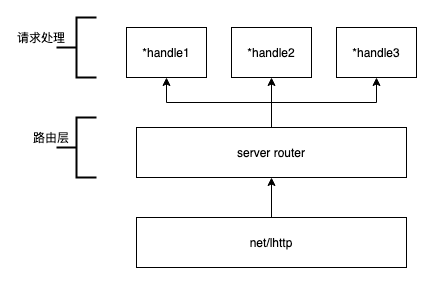

# httprouter

## 一句话描述

httprouter是一个轻量的、高效的`http请求路由器`，对http请求进行路由转发

## 入门示例

```golang
package main

import (
    "fmt"
    "net/http"
    "log"

    "github.com/julienschmidt/httprouter"
)

func Index(w http.ResponseWriter, r *http.Request, _ httprouter.Params) {
    fmt.Fprint(w, "Welcome!\n")
}

func Hello(w http.ResponseWriter, r *http.Request, ps httprouter.Params) {
    fmt.Fprintf(w, "hello, %s!\n", ps.ByName("name"))
}

func main() {
    router := httprouter.New()
    router.GET("/", Index)
    router.GET("/hello/:name", Hello)

    log.Fatal(http.ListenAndServe(":8080", router))
}
```
```shell
➜ curl http://127.0.0.1:8080
Welcome!
➜ curl http://127.0.0.1:8080/hello/golang
hello, golang!
```

## 命名参数

### 匹配一个路由段

语法： 

```:param_name```

示例：

```golang
router.GET("/src/:filename", func(writer http.ResponseWriter, request *http.Request, params httprouter.Params) {
    fileName := params.ByName("filename")
    fmt.Fprintf(writer, "文件名是： %s\n", fileName)
})
```
```shell
➜ curl http://127.0.0.1:8080/src/icon        
文件名是： icon

```


#### 匹配多个路由段

语法： 

```*param_name```

示例：

```golang
router.GET("/src/*filename", func(writer http.ResponseWriter, request *http.Request, params httprouter.Params) {
    fileName := params.ByName("filename")
    fmt.Fprintf(writer, "文件路径是： %s\n", fileName)
})
```
```shell
➜ curl http://127.0.0.1:8080/src/pic/icon.jpg  
文件路径是： /pic/icon.jpg
```

## 路由解析

httprouter为了提高路由匹配的性能，路由解析采用的是[prefix tree](https://en.wikipedia.org/wiki/Trie) or [Radix tree](https://en.wikipedia.org/wiki/Radix_tree) 方式对路由进行解析，该解析方式在进行路由匹配时，可以实现O(n) 的时间复杂度

示例：

路由|handle
:---:|:---:
/|*<1>
/search/|*<2>
/support/|*<3>
/blog/|*<4>
/blog/:post/|*<5>
/about-us/|*<6>
/about-us/team/|*<7>
/contact/|*<8>

解析后结构

```
Priority   Path             Handle
9          \                 *<1>
3          |-s               nil
2            |-earch\        *<2>
1            |-upport\       *<3>
2          |-blog\           *<4>
1               |-:post      nil
1                     |-\    *<5>
2          |-about-us\       *<6>
1                   |-team\  *<7>
1          |-contact\        *<8>
```

## 架构示意图



## 底层数据结构

### 路由

`Router`是所有配置及路由解析后节点树的载体

```golang
type Router struct {
   
   // 节点树，key为method，value为节点树指针
   trees map[string]*node
   
   // 为true时，启动RedirectTrailingSlash策略：如果当前uri没有命中任何路由项，但是存在与当前uri只有一个尾部
   // 斜杠出路的路由项，例如请求uri为/foo/,路由项中并不能命中，但是存在/foo路由项，则会
   // 返回客户端重定向地址，如果请求方法是GET，则返回状态为301，其他请求方法返回307
   RedirectTrailingSlash bool
   
   // 为true时，启动RedirectFixedPath策略：如果当前uri没有命中任何路由项。
   // 首先：移除多余的路由元素，如../ 或 //
   // 其次：对修复后的uri进行忽略大小写的匹配，如果可以匹配到，则路由器将会重定向到匹配到的uri,
   // 如果是GET请求，则response 状态为301，否则为307
   // 例如 /FOO 和 /..//FOO 可以重定向到/foo
   RedirectFixedPath bool

   // 为true时，启动HandleMethodNotAllowed策略：如果当前请求对应的方法不支持该请求，
   // 则路由器将会检测其他方法是否支持该请求，如果MethodNotAllowed存在，则通过
   // MethodNotAllowed处理请求，否则返回405异常
   HandleMethodNotAllowed bool
   
   // 为true时，启动HandleOPTIONS策略：路由器支持自动回复，response头信息中含有支持请求的方法。
   // 如果有自定义handle处理该请求，则自定义handle处理
   HandleOPTIONS bool

   // 一个可选的http.Handler，在OPTIONS请求时可以被自动调用
   // HandleOPTIONS为true，而且当前的path没有针对的OPTIONS handle时，GlobalOPTIONS将会被调用
   // 在GlobalOPTIONS被调用前 header头Allowed参数将会被设置
   GlobalOPTIONS http.Handler
   
   // 缓存全局的被允许的请求方法
   globalAllowed string

   // 一个可选的http.Handler,用于在没有匹配的路由项时调用；如果该值没有设置，则使用http.NotFound 
   NotFound http.Handler

   // 一个可选的http.Handler用于当一个请求没有对应的路由项而且HandleMethodNotAllowed为true时被调用。
   // 如果该值没有被设置，则返回一个405异常。
   // 调用Met hodNotAllowed之前，header头 Allow参数将会被设置
   MethodNotAllowed http.Handler

   // 该handle用于处理http handles处理过程中发生的panics
   // 它应该用来生成一个错误页面并返回http错误代码
   // 该handle可以用来避免你的服务因panics而导致崩溃
   PanicHandler func(http.ResponseWriter, *http.Request, interface{})
}
```

### 节点

节点树的组成元素

```golang
// 节点
type node struct {
   path      string   // 节点路径
   wildChild bool    // 是否存在通配符标识
   nType     nodeType // 节点类型
   maxParams uint8       // 最大参数数量
   priority  uint32    // 优先级
   indices   string   // 子节点path首字母索引，顺序与children一致
   children  []*node  // 子节点列表
   handle    Handle   // 处理程序
}
```

### 节点类型

```golang
type nodeType uint8

// 支持4种类型
const (
   static nodeType = iota  // 静态路由
   root                    // 根节点
   param                   // 命名参数
   catchAll                // catch-all命名参数
)
```

### request处理程序

自定义request处理程序都要实现该函数类型

```golang
type Handle func(http.ResponseWriter, *http.Request, Params)
```

### 路由参数

```golang
type Param struct {
   Key   string
   Value string
}
```

### 路由参数列表

```golang
type Params []Param
```

## 源文件

### path.go

到目前版本为止（v1.3.0），path文件只有一个方法`CleanPath`,`CleanPath`方法的作用是规范化`HTTP request`请求路由，以便最大可能找到想匹配的路由，在 `RedirectFixedPath`参数生效的前提下，重定向到匹配到的路由项

### tree.go

该文件存储`node`相关方法及配置

- addRoute：解析路由项到节点树
- getValue：通过`request path`匹配路由项

### router.go

httprouter整体功能都是在该文件中实现

- ServeHTTP：实现http.Handler接口，接收`net/http`调用，对`http request`请求进行路由转发
- Handle：路由解析底层实现，经过封装支持 `GET、 POST、 PUT、 PATCH、 DELETE`等method路由项解析

## 链接

Github：https://github.com/julienschmidt/httprouter

GoDoc：https://pkg.go.dev/github.com/julienschmidt/httprouter