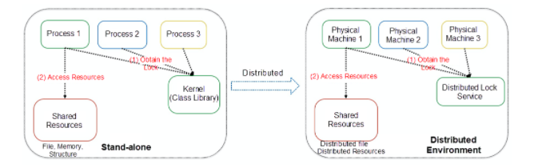
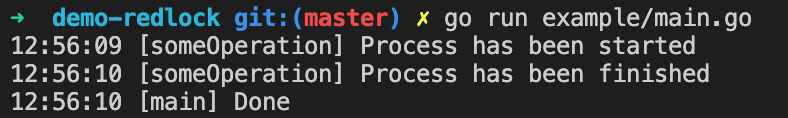
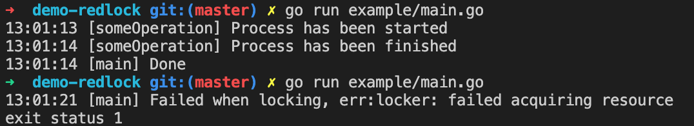
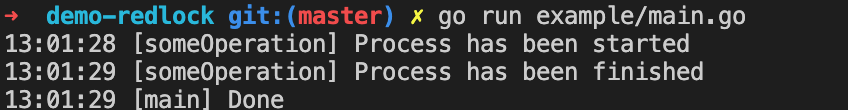

# 在redis上实现分布式锁

​	在多线程编程环境中，我们通常使用锁来限制对共享资源的访问。互斥锁就是其中的一个例子。互斥锁通过只允许一个线程访问数据的方式来保护共享数据（数组， 链表，哈希表或是任何简单的原始类型）

当涉及到分布式系统的时候，很难确保多个应用程序在同一时间做完全相同的事情。如调用外部API，写入外部存储以及执行一些繁重的计算。《Design Data-Intensive Application》一书的作者Matrin Kleppman在他的博客中提到，我们需要对分布式应用加锁有两个原因：

- **效率**：避免做重复的工作；
- **正确性**： 防止并发进程相互干扰而破坏系统状态；



<center>Figure1.独立运行（左边）与阿里云的分布式锁（右边）</center>

redis的作者Salvatore Sanfilippo提出了一种叫做Redlock的算法作为分布式锁管理器（DLM）。您可以在[这一页面]([Distributed locks with Redis – Redis](https://redis.io/topics/distlock))查看Redlock算法的详细信息。我们使用redis实现分布式锁的方式是通过设置一个唯一的生存时间（TTL）键，当客户端使用完资源后，会删除redis上的键，并且如果客户端发生错误，Redis会根据TTL的情况自动释放锁。为了避免单点故障，Redlock被设计为在至少3台具有redis实例的机器上运行。

---

让我们使用Redlock实现分布式锁，在本文中，我们将会使用Go实现。首先我们创建一个Locker接口来执行**Lock**和**Unlock**操作

```go
type Locker interface {
    Lock(ctx context.Context) error
    Unlock(ctx context.Context) error
}
```

然后我们创建一个struct来为Locker的实现保存一些配置。

```go
type locker struct {
    redisClients []*redis.Client
    expiration time.Duration
    drift	time.Duration
    quorum	int
    name	string
    value	string
}
```

- **redisClients**: 因为我们使用了多个redis实例， 因此我们将客户端存储在切片中。在本教程中，我们使用[go-redis](https://github.com/go-redis/redis)作为客户端。

- **expiration**: 锁会根据给定的TTL自动释放。

- **drift**：对redis客户过期的标记。

- **quorum**：[quorum]([Quorum (distributed computing) - Wikipedia](https://en.wikipedia.org/wiki/Quorum_(distributed_computing))将被用于计算最多的失败次数。如果客户端获取锁失败次数小于N/2+1，我们将会尝试解锁所有实例上的资源。N表示redis实例的数量。

- **name**: name是用来作为redis 的键使用的，每个锁应该有唯一的名称。

- **value**: value是一个随机的字符串，因此只有设置他的客户端才有权限对其进行解锁。

  在获取lock的时候，我们需要在key不存在的情况下使用NX选项设置key。

  ```go
  var scriptLock = `
  if redis.call("EXISTS", KEYS[1]) == 1 then
  	return 0
  end
  return redis.call("SET", KEYS[1], ARGV[1], "PX", ARGV[2])
  `
  
  func (l *locker) Lock(ctx context.Context) error {
  	totalSuccess := 0
  
  	for _, rc := range l.redisClients {
  		start := time.Now()
  
  		status, err := rc.Eval(ctx, scriptLock, []string{l.name}, l.value, l.expiration.Milliseconds()).Result()
  		if err != nil {
  			return err
  		}
  
  		ok := status == "OK"
  
  		now := time.Now()
  		isTimeValid := (l.expiration - (now.Sub(start) - l.drift)) > 0
  
  		if ok && isTimeValid {
  			totalSuccess++
  		}
  	}
  
  	if totalSuccess < l.quorum {
  		l.Unlock(ctx)
  		return ErrAcquireResource
  	}
  
  	return nil
  }
  ```

  如果key被成功设置并且设置成功时没有到过期时间，我们应该增加设置成功的计数。如果总的成功计数小于定义的quorum， 我们会调用unlock方法释放所有的锁。并且对于unlock方法的实现，我们只需简单地循环所有客户端，并对每一个客户端进行解锁就可以了。

  ```go
  var scriptUnlock = `
  if redis.call("GET", KEYS[1]) == ARGV[1] then
  	return redis.call("DEL", KEYS[1])
  else
  	return 0
  end
  `
  
  func (l *locker) Unlock(ctx context.Context) error {
  	totalSuccess := 0
  
  	for _, rc := range l.redisClients {
  
  		status, err := rc.Eval(ctx, scriptUnlock, []string{l.name}, l.value).Result()
  		if err != nil {
  			return err
  		}
  
  		if status != int64(0) {
  			totalSuccess++
  		}
  	}
  
  	if totalSuccess < l.quorum {
  		return ErrReleaseResource
  	}
  
  	return nil
  }
  ```

  为了完成整个功能的实现，让我们创建一个结构来保存对out locker实现的连接以及构造函数

  ```go
  type DLM struct {
  	redisClients []*redis.Client
  	quorum       int
  	expiration   time.Duration
  	drift        time.Duration
  }
  
  func NewDLM(redisClients []*redis.Client, expiration time.Duration, drift time.Duration) *DLM {
  	return &DLM{
  		redisClients: redisClients,
  		expiration:   expiration,
  		drift:        drift,
  		quorum:       len(redisClients)/2 + 1,
  	}
  }
  
  func (dlm *DLM) NewLocker(name string) Locker {
  	return newLocker(dlm, name)
  }
  
  func newLocker(dlm *DLM, name string) Locker {
  	return &locker{
  		redisClients: dlm.redisClients,
  		quorum:       dlm.quorum,
  		name:         name,
  		value:        generateRandomString(),
  		expiration:   dlm.expiration,
  		drift:        dlm.drift,
  	}
  }
  
  func generateRandomString() string {
  	var letterRunes = []rune("abcdefghijklmnopqrstuvwxyzABCDEFGHIJKLMNOPQRSTUVWXYZ")
  	b := make([]rune,
  		time.Now().Unix()%64)
  	for i := range b {
  		b[i] = letterRunes[rand.Intn(len(letterRunes))]
  	}
  	return string(b)
  }
  ```

DLM结构将会保存Redis的连接， 我们将会将其作为单例实例。Newlocker将会为locker的实现生成一个新的实例。我们用generateRandomString函数来生成将用作锁定值的简单随机值。随机值生成器可以根据需要随便调整。

---

现在让我们来测试一下我们的实现，我们将使用10s作为过期时间。我们将在执行某个进程后立即调用unlock（我们在进程中放置了1s睡眠）

```go
func main() {
	rc1 := redis.NewClient(&redis.Options{Addr: "0.0.0.0:7001"})
	rc2 := redis.NewClient(&redis.Options{Addr: "0.0.0.0:7002"})
	rc3 := redis.NewClient(&redis.Options{Addr: "0.0.0.0:7003"})

	dlm := demoredlock.NewDLM([]*redis.Client{rc1, rc2, rc3}, 10*time.Second, 2*time.Second)
	ctx := context.Background()
	locker := dlm.NewLocker("this-is-a-key-002")

	if err := locker.Lock(ctx); err != nil {
		log.Fatal("[main] Failed when locking, err:", err)
	}

	// Perform operation.
	someOperation()

	if err := locker.Unlock(ctx); err != nil {
		log.Fatal("[main] Failed when unlocking, err:", err)
	}

	log.Println("[main] Done")
}
	
func someOperation() {
	log.Println("[someOperation] Process has been started")
	time.Sleep(1 * time.Second)
	log.Println("[someOperation] Process has been finished")
}
```

下面是结果，我们成功地执行了该程序：



现在，让我们删除演示代码中的解锁部分。

```go
func main() {
	log.SetFlags(log.Ltime)
	rc1 := redis.NewClient(&redis.Options{Addr: "0.0.0.0:7001"})
	rc2 := redis.NewClient(&redis.Options{Addr: "0.0.0.0:7002"})
	rc3 := redis.NewClient(&redis.Options{Addr: "0.0.0.0:7003"})

	dlm := demoredlock.NewDLM([]*redis.Client{rc1, rc2, rc3}, 10*time.Second, 2*time.Second)

	ctx := context.Background()
	locker := dlm.NewLocker("this-is-a-key-002")

	if err := locker.Lock(ctx); err != nil {
		log.Fatal("[main] Failed when locking, err:", err)
	}

	// Perform operation.
	someOperation()

	// Don't unlock

	log.Println("[main] Done")
```

第一次尝试的时候，它会成功，但是第二次尝试的时候会返回一个错误，因为lock没有被前一次的执行释放。



让我们等待15s，然后再次运行demo. 这次代码将会成功执行，因为lock会在10s后释放。



我们刚刚使用redis为分布式锁实现了了Redlock算法，您可以在此[存储库]([go-exercise/src/etc/demo-redlock at master · syafdia/go-exercise (github.com)](https://github.com/syafdia/go-exercise/tree/master/src/etc/demo-redlock))中查看全部源码。

多谢！

[原文链接](https://syafdia.medium.com/implementing-redlock-on-redis-for-distributed-locks-a3cfe60d4ea4)

参考:
https://en.wikipedia.org/wiki/Mutual_exclusion

https://www.educative.io/blog/multithreading-and-concurrency-fundamentals

https://martin.kleppmann.com/2016/02/08/how-to-do-distributed-locking.html

https://redis.io/topics/distlock

https://redislabs.com/redis-best-practices/communication-patterns/redlock/

https://www.alibabacloud.com/blog/the-technical-practice-of-distributed-locks-in-a-storage-system_597141
